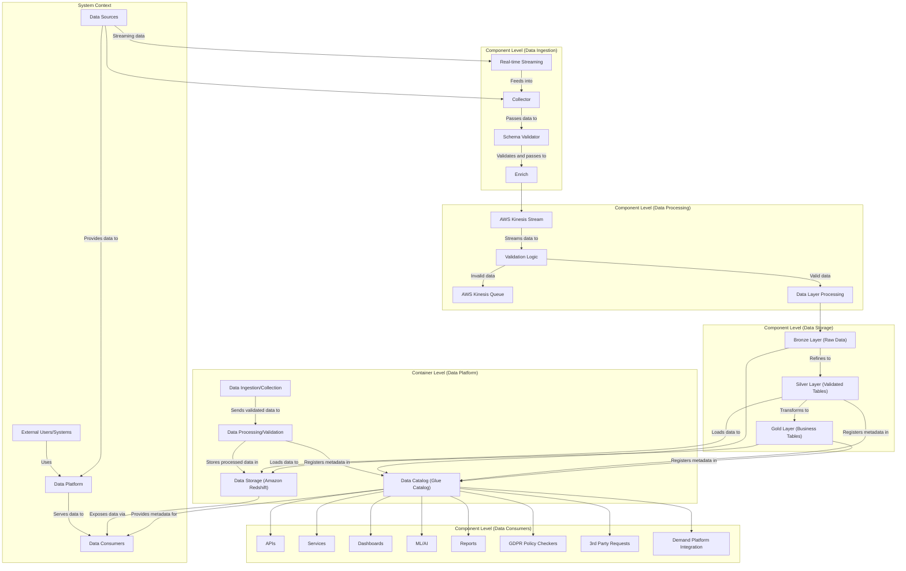

# snowplow_tracking
# Real-Time Event Processing & Analytics Pipeline  

## Overview  
This repository contains an end-to-end **real-time data pipeline** that collects, processes, stores, and aggregates **user events** from multiple platforms (**Android, iOS, mobile web, desktop web, backend services**). The pipeline is designed to handle **~1.5 billion events per day** while ensuring scalability, cost efficiency, and analytical readiness.  

---

## Architecture Diagram  

![Architecture Diagram] (https://github.com/sureshber/snowplow_test/issues/1#issue-2879613248)

---

## Key Features  
- **Near Real-Time Processing:** Snowplow collects, validates, enriches events that are sent to AWS Kinesis streams via Firehose
- **Cost Optimization:** Uses AWS S3 for cost-effective storage and Apache Iceberg for efficient data querying.  
- **ETL Orchestration:** Apache Airflow automates workflows across the data pipeline.  
- **Analytics/metrics/kpis":** Aggregated metrics like DAU, MAU, retention, and funnel analysis can be calculated both in Gold layer in lake and also in microbatched/batched data in Redshift

---

## Technology Stack 

### Data Ingestion  
- **AWS Kinesis:** Scalable real-time event ingestion.  
- **Snowplow:** Provides event tracking with schema validation and enrichment.  

### Data Processing & Orchestration  
- **Apache Airflow:** Orchestration of ETL processes, scheduling and dependency.  
- **AWS Lambda:** Used for event based triggers

### Data Storage  
- **Amazon S3 (Bronze Layer):** Stores raw event data in a raw format
- **Apache Iceberg (Silver Layer):** Provides ACID-compliant table formats for optimized analytics and allows for time travel as needed
- **Amazon Redshift (Gold Layer):** Stores aggregated metrics for dashboards and reporting - also on iceberg possibly.

### Data Aggregation & Analytics  
- **Athena/trino:** Enables querying over S3 data without additional infrastructure.  
- **Redshift:** Supports complex analytical queries (e.g., DAU, MAU, funnel analysis) to optimize for data loads
- **Glue Catalog:** Maintains schema consistency and enables metadata management.  

### Data Consumers  
- **BI Integration:** For business intelligence and self-service analytics.  
- **APIs & Services:** Exposes processed insights to various business applications via DAPI

----------

## Pipeline Workflow  

### Event Collection  
- User interactions are captured across mobile apps, websites, and backend services via snowplow collectors
- Events are sent to **AWS Kinesis Streams** for real-time ingestion.  
- **Snowplow** enforces schema validation before pushing data forward.  

### Data Storage & Processing  
All data good/bad from kinesis are validated through data contracts and validators to allow for next version ingestion.
- **Bronze Layer (S3):** Stores raw event data as JSON/parquet.  
- **Silver Layer (Iceberg):** Data is deduplicated, cleaned, and transformed for analysis.  
- **Gold Layer (Redshift/Iceberg):** Aggregated tables are created for key business metrics.  

### Aggregations & Insights  
- **Daily Active Users (DAU), Monthly Active Users (MAU)** calculations (on lake/redshift)  
- **Real-time marketing intelligence & personalization use cases.**

----------

## C4 Flow Diagram 
# Your Project Name

## Architecture Diagram

